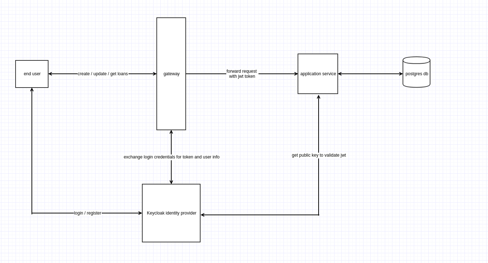

# Viaconto assignment
Demo application for creating, updating, searching Application Loans.
The project is focused on api, Due to limitation of time, the front end part is excluded

# Project Architecture

Stack:
 - Spring Boot / java 11
 - Spring cloud gateway
 - Spring Oauth 2 security
 - Keycloak
 - Flyway
 - Postgres

# Getting Started
## Prerequisites
The following tools need to be installed in order to run the project:
- Docker compose
- Java 11
- Maven 3

## Installing
Navigate to project's root folder and run (This might take up a minute to start all the container)

> docker-compose up

After all container started successfully, you can either build and run the project by maven, or by your favourite idea (e.g: intelij)
Example running by maven:

> cd application-service

> mvn clean install

> java -jar application-service-1.0-SNAPSHOT.jar

Note: you will need to start application-service and gateway to proceed to next step

## Running the tests
The docker-compose already included some data setup for user:

> operation_user / 123456

> normal_user / 123456

The application service provided 5 REST API. Normal user can only access 4 related to Loans, and operation user can access all of these APIs including updating loan's status.

API for normal user:

> POST localhost:8080/application/loans

> GET localhost:8080/application/loans/{id}

> PUT localhost:8080/application/loans/{id}

> GET localhost:8080/application/loans?page=0&size=5&sort=id

API for operation user:

> PUT localhost:8080/application/loans/1/status

Further information about role and client setup, please refer on next section about keycloak

Postman collection and environment is attached in the ./postman folder. Import them and running the it sequentially from 1 -> 6 to see the result. Please find the description for each API as below:

1. Get Token with password

   This API calling keycloak directly to get the jwt token. Will be used for subsequent API calls. The client_id and client_secret is pre-configured in the keycloak. The username and password will be the end user's credentials.
   
2. Create Loan

   This API calls api gateway to create loan
   
3. Get Loan

   This API calls api gateway to get given loan
   
4. Update Loan

   This API calls api gateway to update given loan
   
5. Search Loan

   This API calls api gateway to search loans. It support multiple searching criteria, paging, sorting.
   
6. Update Loan Status

   This API calls api gateway to update loan status. Only user with role update_loan_status can call this API. Attempting to call this API without this role will result 403 error.
   
## Register user

Normal users can go to http://localhost:8080/ . It will redirect user to keycloak's login page. Here you can either login or register new user. After login / register, browser will redirect to gateway homepage, which is just an welcome page.

After register user, we can replace the username / password in postman API and make call

## Keycloak

[Keycloak](https://www.keycloak.org/) is an open source software product to allow single sign-on with Identity and Access Management. It also support various standard protocol. This project uses it mainly as Identity Provider in OAuth2 flow.

With pre-configured data in docker compose that already setup, which including:

- Client id and client secret: Our gateway can use it as OAuth2 client

- Oauth 2 Scope: Allow us to check in our Resource Server (application-service)

- Users: store user information, login / registering features. 

- Roles: roles setup and also returned in jwt token.

Login to [local keycloak](http://localhost:8888/auth/realms/master/protocol/openid-connect/auth?client_id=security-admin-console&redirect_uri=http%3A%2F%2Flocalhost%3A8888%2Fauth%2Fadmin%2Fmaster%2Fconsole%2F%23%2Frealms%2Fviaconto&state=5afcfb24-e00e-4ff6-8236-8554ab34ce5c&response_mode=fragment&response_type=code&scope=openid&nonce=165da97b-4d05-4887-98cc-9209f0813f82&code_challenge=jH9oen3BthsAUkrfMnePixmb1dipWsqFS5Nq3RNbQ40&code_challenge_method=S256) with spring / spring123 and navigate to Viaconto realm to see these configurations
